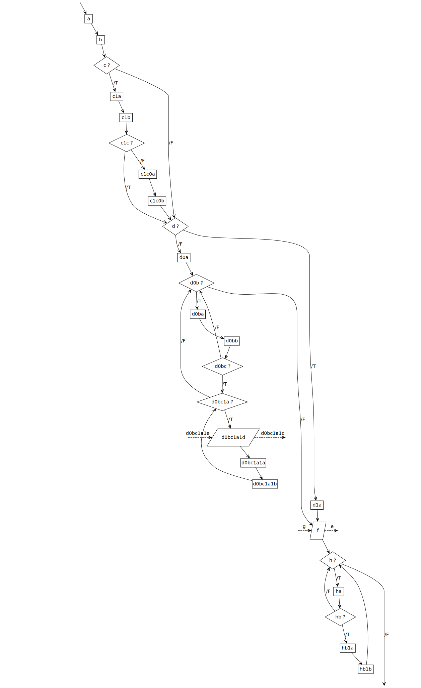
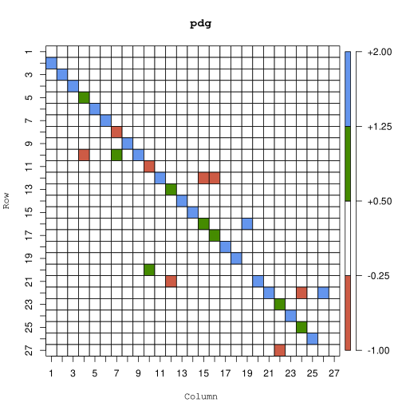

# yafc

Y*aml* A*s* F*low* C*hart*

Generate a flowchart from a YAML file.

## Usage

### Flow char YAML specification

- A flow chart is supposed to be a **list**
	- Every node is the list element
	- The flow order is the list order

#### Atom, IO, branch, and loop

- Atom nodes
	- A atom node is supposed to be a element of the list with yaml atomic type

		> In most cases it should be a string to describe what this step do.
		> Other atomic will be convert to string still.

- IO nodes
	- A IO node is supposed to be a element of the list with yaml associative array type
		- The top level must contain only a key, the key describe *what to output*
			- *what to ouput* contains another associative array.
				Its key describe *what to do*.
				And its value is supposed to be yaml atomic type,
				describing *what to input*

	> *i.e.* ``` what to output : {what to call : what to input}```

- Branch nodes
	- A branch node is supposed to be a element of the list with yaml associative array type
	- The top level must contain only a key, the key describe the branch *condition*
		- Another associative array will be under the *condition*.
			Only yaml/``` true ``` or yaml/``` false ``` and at least 1 of them
			can be in its keys.
			- yaml/``` true ``` or yaml/``` false ``` contains its sub flow list

	> *i.e.* ```{ condition : {{true:[...]} , {false:[...]}} }```

- Loop nodes
	- A branch node is supposed to be a element of the list with yaml associative array type
	- The top level must contain only a key, the key describe the branch *condition*
		- ``` condition ``` contains its sub flow list

	> *i.e.* ```{ condition : [...] }```

#### Limit

- Delay condition loop *aka* ``` do-while ``` is not allowed
- Empy branch or loop is not allowed

	> Note that **yafc** cannot distinguish infinite loop,
	> any loop contain any step(but at least 1) will be infinite with a infinite condition.
	> Of cause we can write 'doing nothing' in node or 'TRUE'/'infinite' in condition.

### Invoke

```
./yaml2py < .yaml | R -s --no-save | R -s --no-save -f ./r2dot.r
```
where ``` .yaml ``` is the flow chart yaml file.

Command above will generate a dot file ``` .dot ``` to standard output,
use [graphviz](https://graphviz.org/)
to convert it to pdf/svg/png/*etc*.
*e.g.* to svg :
```
./yaml2py < .yaml | R -s --no-save | R -s --no-save -f ./r2dot.r | dot -Tsvg
```

[``` sample.ninja ```](sample.ninja) show a example from [``` stdf.yaml ```](stdf.yaml)

Or use [R](https://r-project.org/)
to process the core data to generate any other readable filetipe. Refer to [#Development](#Development).

### E.g.

From [``` stdf.yaml ```](stdf.yaml)


### Docker

- image ``` lujialin/yafc:dot ```  
	Read yaml content from standard input and print dot content to standard output  
	*e.g.*

	```
	docker run --rm -i lujialin/yafc:dot < stdf.yaml | dot -Tsvg
	```

- image ``` lujialin/yafc:svg ```  
	Read yaml content from standard input and print svg content to standard output  
- image ``` lujialin/yafc:pdf ```  
	Read yaml content from standard input and print pdf content to standard output  

> Currently only the ``` :dot ``` is valid. Alpine linux graphviz package doesn't work, please use new version.

## Development

### Standard Flow Matrix -- The MOST IMPORTANT data structure

As the name suggests, Standard Flow Matrix(STM) is a matrix.
Actually it is similar to a adjacency matrix of control flow in
Program Dependency Graph(PDG).

STM([**S**]) specification :

- Numbering flow nodes in a flow by the matrix row/column number

	> so it is supposed to be a square matrix.

- For a value [**S**]<sub><i>i</i>,<i>j</i></sub> in the **S** located at *i* row and *j* column :
	- [**S**]<sub><i>i</i>,<i>j</i></sub> is **1**
		- If *j* is a branch node and the *true* branch path is from *i* to *j*
	- [**S**]<sub><i>i</i>,<i>j</i></sub> is **-1**
		- If *j* is a branch node and the *false* branch path is from *i* to *j*
	- [**S**]<sub><i>i</i>,<i>j</i></sub> ∉ **{-1 , 0 , 1}**
		- If *j* is a trival node and there is a path from *i* to *j*

		> [``` yaml2r.py ```](yaml2r.py) use 2 here

	- [**S**]<sub><i>i</i>,<i>j</i></sub> is **0**
		- Others

Some properties in a STM([**S**]) of correct standard control flow :

- Count of none 0 value in a column **S**<sub><i>i</i></sub> should be in **{0 , 1 , 2}** and :
	- Only the last column is 0 and it should be always 0 as a result STM
	- Only branch or loop condition node is 2
	- [**S**]<sub><i>i</i>,<i>i</i></sub> is always 0
	- [**S**]<sub><i>i</i>,<i>j</i></sub> is trival value(∉ **{-1 , 0 , 1}**) and *j* < *i* + 1 means a loop back

*e.g.* STM of [``` stdf.yaml ```](stdf.yaml) is :



[``` yaml2r.py ```](yaml2r.py) generate R statements to generate a R list data contain :

- STM of control flow described by the yaml file in ``` $M ``` field
- Node description in ``` $I ``` field
- Node input description in ``` $i ``` field
- Node input description in ``` $o ``` field

as ``` .rds ``` format to the standard output.

So ``` yaml2r.py < .yaml | R -s --no-save > .rds ```
will save informations above to ``` .rds ```

And [``` r2dot.r ```](r2dot.r) just generate dot statements according to the STM ``` .rds ```


### Why more

#### Why YAML

- YAML may be the readable, structured text contain most data type

	> Especially YAML can use boolean value as key to describe branch

- YAML can show more "pure" content of the flow chart
	- YAML use as less as possible none whitespace character to define list

		> Especially list element can be without suffix. Such as ``` , ``` in TOML or JSON

	- YAML use as less as possible none whitespace character to define string
- Pyyaml is a part of python standard

#### Why Python

- Pyyaml is a part of python standard
- Python has stricter atom data type to distinguish them

	> Especially for that it was hard to distinguish character vector and "string vector" in R

#### Why R

As said above, Standard Flow Matrix(STM) is the most important concept and structure,
and it is a matrix.

- R support native matrix and it can index matrix element or matrix area in lots of ways easily
- All information include STM can be saved into RDS without any other additional definition out of R itself
